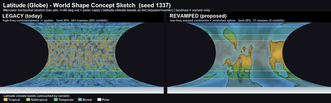

# Latitude Design Artifacts

This folder preserves concept sketches and visual planning artifacts for Latitude that are useful to keep near the project, but are not proof that the pictured feature is implemented.

## Latitude 1.x world-shape concept

- File: `latitude-1x-world-shape-concept-seed-1337.png`
- Source image: Julia-supplied concept sketch, originally named `image-1780844141229.png`
- Captures: legacy strip-style world shape versus a proposed lower-drag warped-continent revamp, seed `1337`
- Status: concept/reference only
